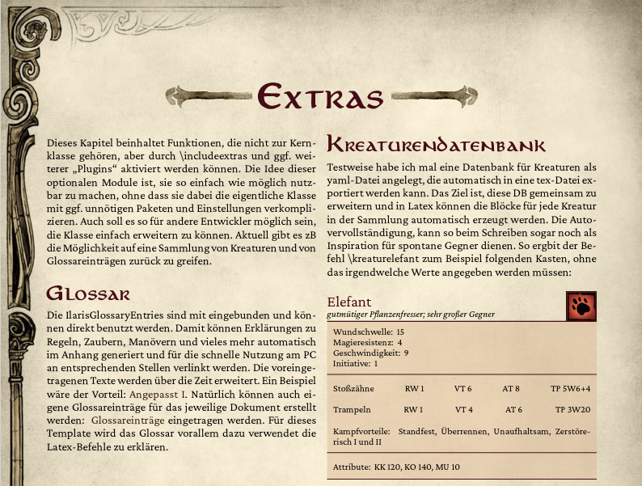

## IlarisTex

Eine Latex-Klasse zum erstellen von Spielhilfen und Abenteuern für das alternative Ilaris Regelwerk.Dies Projekt ist als Alternative zu Ilaris-Latex entstanden, das zur Zeit nicht weiterentwickelt wird. Es ist noch unvollständig, aber bereits benutzbar. Mithilfe erwünscht.

### Vorschau



Eine Beispiel-PDF befindet sich im [letzten Releas](https://github.com/Ilaris-Tools/IlarisTex/releases/latest/)

### Features

- Pergament-, Info-, Proben-, Bild- und Kreaturenkästen
- Seitenlayout, Spalten und Hintergrund
- Extraseiten zum Drucken von Karten und Handouts
- Schriftarten, Überschriften, (Tabellen), Farben
- Einfache hübsche Einbindung von Bildern
- Optionale Plugins für Glossar und Datenbanken
- Latex-Paket für einfache Nutzung/Installation

### Geplant

- Tintensparende Druckversion
- Mehr Kästen und Layout-Optionen
- Anleitung und mehr Beispiele
- viele weitere Kleinigkeiten
- Abenteuervorlage

## Installation

Es muss eine aktuelle TexLive Version installiert sein, oder das Paket tcolorbox manuell aktualisiert werden, damit teilweise transparente Hintergründe funktionieren. [Infos zum Aktualisieren](https://tex.stackexchange.com/questions/55437/how-do-i-update-my-tex-distribution).

### Latex-Paket für Nutzer

Die neuste Version der IlarisTex-Klasse kann [hier](https://github.com/Ilaris-tools/IlarisTex/releases/latest) heruntergeladen werden. Enthalten ist ein Ordner `texmf`, der direkt in den Benutzerordner der Latex installation (`~/texmf/` unter Linux) kopiert werden kann. Falls der Ordner schon existiert, kann er hereinkopiert werden. Beim der ersten Installation, sollten keine Datei-Konflikte auftreten. Alle nötigen Schriftarten, Klassen, Grafiken und die plugins sind bereits enthalten und die Klasse sollte via `\documentclass{Ilaris}` in jedem .tex-Dokument verwendet werden können.

In dem Release ist außerdem ein Beispielprojekt, das zum Testen oder als Vorlage genutzt werden kann. Wenn ihr mit Xelatex aus diesem Beispielprojekt ein PDF bauen könnt, ist die "Installation" der LaTeX-Klasse erfolgreich gewesen. Das Projekt kann an eine beliebige Stelle entpackt werden.

#### Update

Zum Updaten auf eine neuere Version von IlarisTex, kann wie bei der Installation verfahren werden, wobei alle existierenden Dateien beim Entpacken überschrieben werden. Zwischen den Versionen kann es kleine Inkompatibilitäten geben, sodass Dokumente eventuell minimal angepasst werden müssen. Ab Version 1.0 wird auf diese Änderungen explizit hingewiesen.

### Repository für Entwickler

Wer vor hat an dem Projekt mitzuarbeiten, oder mehrere verschiedene Versionen der Klasse verwenden will, kann sie auch in einem lokalen Ordner verwenden. Dazu diese Repository klonen (oder herunterladen und entpacken).

```
git clone git@github.com:Ilaris-dev/IlarisTex.git
```

Die Klasse kann so allerdings nur in .tex Dateien innerhalb dieses Ordner verwendet werden.

## Plugins

### Kreaturen

Die Kreaturenkästen stehen auch ohne die `kreaturen.tex` zur Verfügung. Allerdings stellt die automatisch aus der [IlarisDB](https://github.com/Ilaris-dev/IlarisDB) generierte Datei Kurzbefehle für sämtliche Kreaturen bereit. Eine Standardliste ist der Installation beigelegt und kann zB durch Befehle wie `\kreaturbaer` genutzt werden. Für eine eigene Kreaturenliste einfach eine Datei mit dem Namen `kreaturen.tex` neben der `template.tex` anlegen.

### Glossar

Die Datei `glossar.tex` ist Teil von [IlarisGlossaryEntries](https://github.com/XaverStiensmeier/IlarisGlossaryEntries) und wurde von Xaver Stiensmeier erstellt. Sie kann durch einzelne Einträge im jeweiligen Projekt ergänzt werden, oder durch eine vollkommen eigene/neuere Datei ersetzt werden, indem sie neben der zu bauenden `template.tex` Datei gespeichert wird.
Das Glossar wird automatisch geladen und Kurzbefehle zum Einbinden und Formatieren stehen durch `\include{extras-glossar.tex}` zur Verfügung.
Wenn ein Glossar nur für bestimmte Einträge verwendet werden soll, muss es mit `makeglossaries template` (ohne .tex) gebaut werden. Zum Beispiel durch folgende Befehle (nacheinander):

```
xelatex template.tex
makeglossaries template
xelatex template.tex
```

## Unterschiede zu Ilaris-Latex

- Ziel: Einfache selbsterklärende, deutsche Befehle statt Latex Tutorial
- Modulare Kreaturenkästen (mehrere einzelne statt einem komplizierten Befehl)
- Direkte Einbindung der IlarisDB (im Aufbau) und des IlarisGlossars
- (Noch) keine coole Druckversion

## Abweichungen zum Ilaris Layout

- Teilweise alternative Schriftarten mit passenderen Lizenzen
